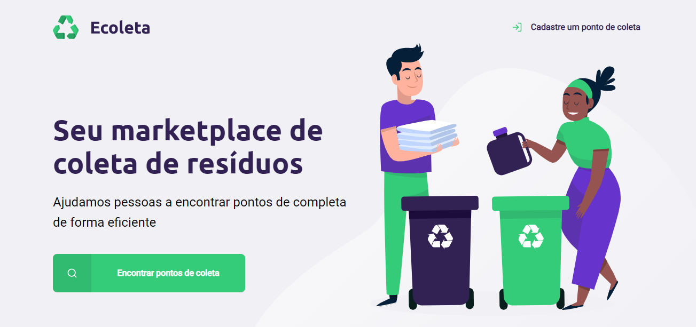
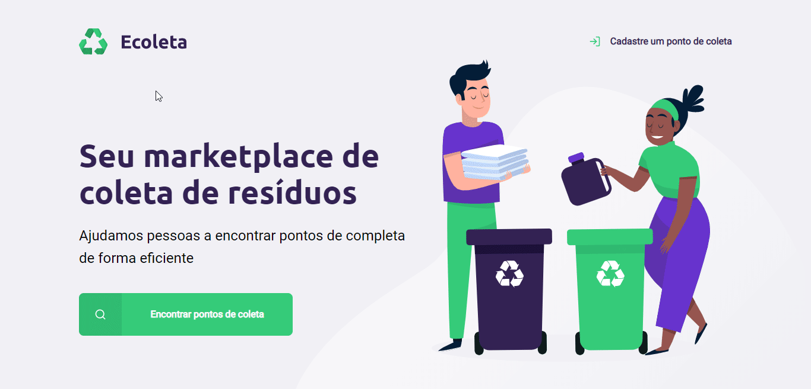
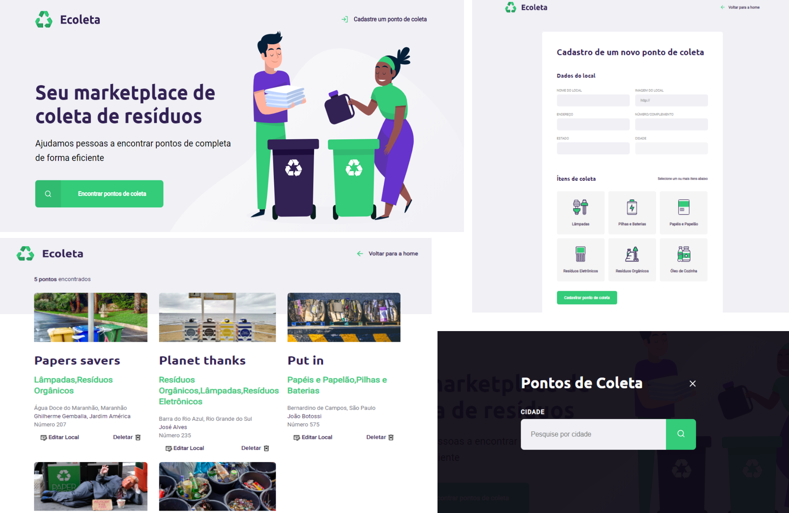
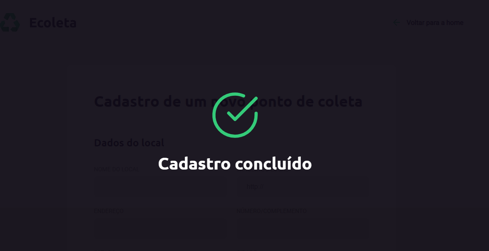

<h1 align="center">
    
</h1>



<h4 align="center">🏁 Aplicação já finalizada 🏁</h4>
<h2 align="center">

[](https://github.com/pauloreis7/Ecoleta/issues)
[](https://github.com/pauloreis7/Ecoleta)
[](https://github.com/pauloreis7/Ecoleta/commits)
[](https://github.com/pauloreis7/Ecoleta/stargazers)
[](https://github.com/pauloreis7/Ecoleta/blob/master/LICENSE)
	
</h2>

<p align="center">♻️ Ecoleta, aplicação focada no apoio ao meio ambiente </p>



## 🔗 Índice
---
 <p>👉 <a href="#sobre">Sobre o projeto</a> </p>
 <p>👉 <a href="#layout">Layout da aplicação</a> </p>
 <p>👉 <a href="#func">Funcionalidades</a> </p>
 <p>👉 <a href="#tecs">Tecnologias utilizadas</a> </p>
 <p>👉 <a href="#requests">Pré-requisitos do projeto</a> </p>
 <p>👉 <a href="#work"> Download e execução do projeto</a> </p>
 <p>👉 <a href="#contribuir"> Contribuir com o projeto </a> </p>
 <p>👉 <a href="#autor"> Autor </a> </p>
 <p>👉 <a href="#license"> Licença </a> </p>

 


<a id="sobre"></a>
## 🔎 Sobre o projeto
---
<p >Aplicação de pontos de coleta de resíduos fornecidos por empresas para preservar o <b>meio ambiente</b></p>

<a id="layout"></a>
## 🎨 Layout
---



🚀 Projeto desenvolvido durante a NLW - Next Level Week pela Rocketseat. Uma experiência online com muito conteúdo prático, desafios e hacks durante uma semana 🚀

<a id="func"></a>
## ✅ Funcionalidades
---
- [x] Cadastro de pontos de coleta
- [x] Listagem de ponto de coletas
- [x] Busca por pontos de coleta pela cidade
- [x] Edição de ponto de coleta
- [x] Deletar ponto de coleta
- [x] Mensagens de alerta ao usuário após cada ação

<a id="tecs"></a>
## 🛠️ Tecnologias
---
💻 Projeto desenvolvido com as seguintes tecnologias

- [JavaScript](https://developer.mozilla.org/en-US/docs/Web/JavaScript)
- [Node.js](https://nodejs.org/en/)
- [Express](https://expressjs.com/pt-br/api.html)
- [nunjucks](https://mozilla.github.io/nunjucks/)
- [Sqlite3](https://www.sqlite.org/docs.html)
- [JSON](https://developer.mozilla.org/pt-BR/docs/Web/JavaScript/Reference/Global_Objects/JSON)
- [HTML](https://developer.mozilla.org/pt-BR/docs/Web/HTML)
- [CSS](https://devdocs.io/css/)

<a id="requests"></a>
## 🚨 Pré-requisitos do projeto
---
 Antes de começar, você vai precisar ter instalado em sua máquina as seguintes ferramentas:

* [Git](https://git-scm.com)
* [Node.js](https://nodejs.org/en/)

💡 Além disso é bom ter um editor para trabalhar com o código como [VSCode](https://code.visualstudio.com/)

<a id="work"></a>
## 🏄‍♂️ Download e execução do projeto
---

````bash

# Clonar o repositório
$ git clone <https://github.com/pauloreis7/Ecoleta>

# Acessar a pasta do projeto terminal/cmd
$ cd Ecoleta

# Vá para a pasta server
$ cd server

# Instalar as dependências
$ npm install

# Executar a aplicação
$ npm start

# O servidor inciará na porta:3000 
acesse  <http://localhost:3000>
````

<a id="contribuir"></a>
## 🎉 Como contribuir para o projeto

[](https://github.com/pauloreis7/Ecoleta/pulls)

---

1. Faça um fork do projeto.
2. Crie uma nova branch com as suas alterações: git 3. checkout -b my-feature
4. Salve as alterações e crie uma mensagem de commit contando o que fez: git commit -m "feature: My new feature"
4. Envie as suas alterações: git push origin my-feature


<a id="autor"></a>
## Autor
---

## 👨‍💻 Autor

<a href="https://github.com/pauloreis7">


<b>Paulo Reis</b> 🏆 

</a>

<p>Feito por Paulo Reis 🤴 Entre em contato 👋</p>

[](https://www.facebook.com/paulofulano.reis)
[](https://www.instagram.com/paulo_reis.dev/)
[](mailto:paulosilvadosreis2057@gmail.com)

<a id="license"></a>
## 📝 Licença
---
Este projeto esta sobe a licença MIT 🏛️